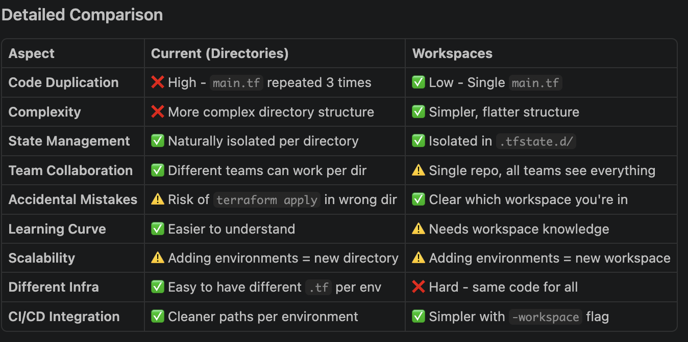

# Terraform: Workspaces vs Directory-Based Setup

A comprehensive guide comparing two approaches to managing multiple environments in Terraform.

## 📋 Table of Contents

- [Quick Comparison](#quick-comparison)
- [Your Current Setup (Directories)](#your-current-setup-directories)
- [Workspaces Setup](#workspaces-setup)
- [Detailed Comparison](#detailed-comparison)
- [When to Use Each](#when-to-use-each)
- [Migration Guide](#migration-guide)
- [Examples](#examples)

---



Your current setup has the same main.tf in 3 places
With workspaces, one main.tf serves all environments
Cleaner Repository

Less clutter
Easier to find and update code
Single source of truth
Standard Terraform Practice

Workspaces are the recommended approach for multi-environment setups
Better supported by tools and documentation
Easier Scaling

Adding a new environment = 1 command instead of creating new directory
terraform workspace new staging vs creating staging/ directory
Better for Your Use Case

Since all 3 environments use the same infrastructure (EC2 + S3)
Only differences are configuration (region, names, tags)
This is exactly what workspaces are designed for
When to Use Directories Instead:
❌ Very different infrastructure per environment (separate networks, databases, etc.)
❌ Different teams managing different environments
❌ Strict separation requirements (security, compliance)
❌ Different Terraform code per environment
Quick Summary:
Your Current Setup = Good for organizational separation (different teams, different infra)

Workspaces = Good for configuration variations (same infra, different settings) ← This is you

---

## Your Current Setup (Directories)

### Structure
```
Terraform/
├── modules/
│   ├── ec2/
│   │   ├── main.tf
│   │   └── variables.tf
│   └── s3/
│       ├── main.tf
│       └── variables.tf
├── dev/
│   ├── main.tf
│   ├── dev.tfvars
│   └── .gitignore
├── test/
│   ├── main.tf
│   ├── test.tfvars
│   └── .gitignore
└── prod/
    ├── main.tf
    ├── prod.tfvars
    └── .gitignore
```

### How It Works

1. Each environment is a **separate directory**
2. Each directory has its own `main.tf` calling the modules
3. Each directory has its own `.tfstate` file (automatically)
4. Variables passed via `.tfvars` files

### Deployment Steps

```bash
# Deploy to dev
cd dev
terraform init
terraform plan -var-file=dev.tfvars
terraform apply -var-file=dev.tfvars

# Deploy to test
cd ../test
terraform init
terraform plan -var-file=test.tfvars
terraform apply -var-file=test.tfvars

# Deploy to prod
cd ../prod
terraform init
terraform plan -var-file=prod.tfvars
terraform apply -var-file=prod.tfvars
```

### State Files Location

```
dev/
  .terraform/
  terraform.tfstate
  terraform.tfstate.backup

test/
  .terraform/
  terraform.tfstate
  terraform.tfstate.backup

prod/
  .terraform/
  terraform.tfstate
  terraform.tfstate.backup
```

### Pros ✅

1. **Clear Separation**: Each environment is visually separated
2. **Intuitive**: Easy to understand which directory for which environment
3. **Natural Isolation**: State files are naturally isolated by directory
4. **Different Code**: Easy to have different infrastructure per environment
5. **Team Separation**: Different teams can work on different directories
6. **Easy Git**: Can have separate branches per environment
7. **Fewer Mistakes**: Clear where you are (current directory)

### Cons ❌

1. **Code Duplication**: `main.tf` repeated 3 times (DRY violation)
2. **Complex Structure**: More directories to maintain
3. **Maintenance**: Changes to infrastructure must be made in 3 places
4. **Scaling**: Adding a new environment requires creating new directory structure
5. **Repository Size**: More files to track in git
6. **Consistency Risk**: Easy to accidentally make different configs

---

## Workspaces Setup

### Structure
```
Terraform/
├── modules/
│   ├── ec2/
│   │   ├── main.tf
│   │   └── variables.tf
│   └── s3/
│       ├── main.tf
│       └── variables.tf
├── main.tf                          # Single configuration
├── dev.tfvars
├── test.tfvars
├── prod.tfvars
└── terraform.tfstate.d/             # Auto-created
    ├── dev/
    │   └── terraform.tfstate
    ├── test/
    │   └── terraform.tfstate
    └── prod/
        └── terraform.tfstate
```

### How It Works

1. **Single `main.tf`** for all environments
2. **Workspaces** provide separate state management
3. **Switch** between workspaces with command
4. **Same code**, different configurations

### Deployment Steps

```bash
# Create workspaces
terraform workspace new dev
terraform workspace new test
terraform workspace new prod

# Deploy to dev
terraform workspace select dev
terraform init
terraform plan -var-file=dev.tfvars
terraform apply -var-file=dev.tfvars

# Deploy to test
terraform workspace select test
terraform init
terraform plan -var-file=test.tfvars
terraform apply -var-file=test.tfvars

# Deploy to prod
terraform workspace select prod
terraform init
terraform plan -var-file=prod.tfvars
terraform apply -var-file=prod.tfvars
```

### State Files Location

```
terraform.tfstate                    # default workspace
terraform.tfstate.d/
  dev/
    terraform.tfstate
  test/
    terraform.tfstate
  prod/
    terraform.tfstate
```

### Using Workspaces in Code

```hcl
# Reference current workspace
variable "environment" {
  default = terraform.workspace
}

# Or use local
locals {
  environment = terraform.workspace
}

resource "aws_s3_bucket" "demo_s3" {
  bucket = "${local.environment}-${var.bucket_name}"
  
  tags = {
    Environment = local.environment
  }
}
```

### Pros ✅

1. **No Code Duplication**: Single `main.tf` for all environments
2. **DRY Principle**: Changes apply to all environments
3. **Simple Structure**: Flatter directory structure
4. **Easy Scaling**: New environment = `terraform workspace new staging`
5. **Clear Current State**: `terraform workspace show` shows current workspace
6. **Standard Practice**: Terraform's recommended approach
7. **Smaller Repository**: Fewer files
8. **Consistency**: Guaranteed same code across environments

### Cons ❌

1. **Single Code Base**: Hard if environments need different infrastructure
2. **Team Overlap**: All teams see all workspaces
3. **Less Obvious**: Not as visually clear which environment you're in
4. **Workspace Management**: Need to remember to select workspace
5. **Learning Curve**: Requires understanding workspace concepts
6. **Less Separation**: Everything is in one directory

---

## Detailed Comparison

### Code Organization

**Directories (Your Current)**
```bash
# Clear separation by viewing directory structure
$ ls -la
dev/
test/
prod/
modules/

# Easy to understand at a glance
```

**Workspaces**
```bash
# Less obvious from file structure
$ ls -la
main.tf
dev.tfvars
test.tfvars
prod.tfvars
modules/

# Need to check workspace
$ terraform workspace list
  default
  dev
* test
  prod
```

### Adding New Environment

**Directories**
```bash
# Create new directory structure
mkdir staging
cp -r dev/* staging/
# Edit staging/main.tf to match
# Edit staging/staging.tfvars
# Update all paths in main.tf
# 5-10 minutes of work
```

**Workspaces**
```bash
# Single command
terraform workspace new staging
cp prod.tfvars staging.tfvars
# 1 minute of work
```

### State File Management

**Directories**
```
dev/terraform.tfstate
test/terraform.tfstate
prod/terraform.tfstate
```

**Workspaces**
```
terraform.tfstate.d/dev/terraform.tfstate
terraform.tfstate.d/test/terraform.tfstate
terraform.tfstate.d/prod/terraform.tfstate
```

### Protecting against Mistakes

**Directories**
```bash
# Risk: apply in wrong directory
$ pwd
/Users/ma2301/Desktop/terraform/Terraform/test

$ terraform apply -var-file=dev.tfvars
# Oops! Applied dev config to test infrastructure
```

**Workspaces**
```bash
$ terraform workspace show
test

$ terraform apply -var-file=dev.tfvars
# Shows "test" in plan output - clearer warning
```

### Git Organization

**Directories**
```bash
# Can branch by environment
git checkout -b dev
# Can have separate .gitignore per env
# More flexibility with git structure
```

**Workspaces**
```bash
# Single branch for all environments
git checkout -b feature/new-s3-config
# All workspaces updated in same commit
# Simpler git workflow
```

---

## When to Use Each

### ✅ Use **Directories** When:

1. **Different Infrastructure per Environment**
   ```hcl
   # Dev: simple setup
   # Prod: complex with HA, load balancing, etc.
   ```

2. **Different Teams Managing Environments**
   ```
   - Dev team: manages dev/
   - Ops team: manages prod/
   - QA team: manages test/
   ```

3. **Strict Separation Requirements**
   - Security/Compliance requirements
   - Isolated git repositories per environment
   - Different AWS accounts per environment

4. **Team Preferences**
   - Team familiar with directory-based structure
   - Easier to train new team members

### ✅ Use **Workspaces** When:

1. **Same Infrastructure, Different Configs** ← **This is you!**
   ```hcl
   # All environments: 1 EC2 + 1 S3
   # Only differences: region, instance type, names
   ```

2. **Simple, Consistent Environments**
   - Same resource structure
   - Only configuration differences

3. **Rapid Environment Scaling**
   ```bash
   terraform workspace new staging
   terraform workspace new qa
   terraform workspace new demo
   # All in seconds
   ```

4. **Single Team Managing All Environments**
   - Devops team handles all environments
   - Clear responsibility

5. **CI/CD with Multi-Environment**
   ```bash
   for env in dev test prod; do
     terraform workspace select $env
     terraform apply -var-file=$env.tfvars
   done
   ```

---

## Migration Guide

### From Directories to Workspaces

If you decide to migrate from your current setup to workspaces:

#### Step 1: Create Root main.tf

```bash
# Copy dev/main.tf to root
cp dev/main.tf ./main.tf
```

#### Step 2: Create Workspaces

```bash
cd /Users/ma2301/Desktop/terraform/Terraform

terraform workspace new dev
terraform workspace new test
terraform workspace new prod
```

#### Step 3: Initialize Each Workspace

```bash
# Dev
terraform workspace select dev
terraform init
terraform plan -var-file=dev.tfvars

# Test
terraform workspace select test
terraform init
terraform plan -var-file=test.tfvars

# Prod
terraform workspace select prod
terraform init
terraform plan -var-file=prod.tfvars
```

#### Step 4: Import Existing Resources (Optional)

If you already have resources:
```bash
terraform workspace select dev
terraform import module.ec2.aws_instance.demo_ec2 i-1234567890abcdef0
terraform import module.s3.aws_s3_bucket.demo_s3 bucket-demo-terraform-hypha-dev
```

#### Step 5: Clean Up

```bash
# Backup directories
tar -czf terraform-backup.tar.gz dev/ test/ prod/

# Remove old directories
rm -rf dev/ test/ prod/
```

#### Step 6: Verify

```bash
terraform workspace list
terraform workspace select dev
terraform plan -var-file=dev.tfvars
```

---

## Examples

### Current Setup: Deploy to All Environments

```bash
#!/bin/bash

for env in dev test prod; do
  echo "=== Deploying to $env ==="
  cd $env
  terraform plan -var-file=$env.tfvars
  terraform apply -var-file=$env.tfvars -auto-approve
  cd ..
done
```

### Workspaces: Deploy to All Environments

```bash
#!/bin/bash

for env in dev test prod; do
  echo "=== Deploying to $env ==="
  terraform workspace select $env
  terraform plan -var-file=$env.tfvars
  terraform apply -var-file=$env.tfvars -auto-approve
done
```

### Useful Workspace Commands

```bash
# List all workspaces
terraform workspace list

# Show current workspace
terraform workspace show

# Create workspace
terraform workspace new staging

# Select workspace
terraform workspace select staging

# Delete workspace (must not be selected)
terraform workspace select default
terraform workspace delete staging

# New and select in one command (Terraform 0.13+)
terraform workspace select -or-create staging
```

### Using Workspace in Code

```hcl
# Reference current workspace in resources
resource "aws_instance" "demo_ec2" {
  ami           = var.ami
  instance_type = var.instance_type

  tags = {
    Name        = var.tag1
    Environment = terraform.workspace
    ManagedBy   = "Terraform"
  }
}

# Conditional logic based on workspace
locals {
  is_prod = terraform.workspace == "prod"
}

resource "aws_instance" "demo_ec2" {
  ami           = var.ami
  instance_type = local.is_prod ? "t3.medium" : "t3.micro"
  
  monitoring = local.is_prod ? true : false
}
```

---

## Decision Matrix

Use this matrix to decide:

```
┌─────────────────────────────────────────────────────────┐
│ Do you need DIFFERENT INFRASTRUCTURE per environment?   │
├─────────────────────┬───────────────────────────────────┤
│ YES                 │ Use DIRECTORIES                   │
│ NO                  │ Continue reading...               │
└─────────────────────┴───────────────────────────────────┘
                              ↓
┌─────────────────────────────────────────────────────────┐
│ Do different TEAMS manage different environments?       │
├─────────────────────┬───────────────────────────────────┤
│ YES                 │ Use DIRECTORIES                   │
│ NO                  │ Continue reading...               │
└─────────────────────┴───────────────────────────────────┘
                              ↓
┌─────────────────────────────────────────────────────────┐
│ Do you prefer SIMPLE over ORGANIZATIONAL STRUCTURE?     │
├─────────────────────┬───────────────────────────────────┤
│ YES                 │ Use WORKSPACES ✅                 │
│ NO                  │ Use DIRECTORIES ✅                │
└─────────────────────┴───────────────────────────────────┘
```

---

## Summary

### Your Current Setup (Directories) is Good For:
- ✅ Clear visual separation
- ✅ Team-based organization
- ✅ Can have different infrastructure per env
- ❌ Code duplication
- ❌ More complex maintenance

### Workspaces is Good For:
- ✅ No code duplication
- ✅ Same infrastructure, different configs
- ✅ Simpler to scale
- ❌ Less visual separation
- ❌ Requires workspace knowledge

### Recommendation for Your Use Case:

**Your infrastructure is identical across all 3 environments** (1 EC2 + 1 S3). Only configurations differ (region, names, tags). This is the **ideal use case for Workspaces**.

**But your current Directory setup is NOT wrong** — it works perfectly fine and many teams use it. The choice depends on your team's preferences and future plans.

---

**Last Updated**: May 8, 2026  
**Terraform Version**: ~> 6.0
